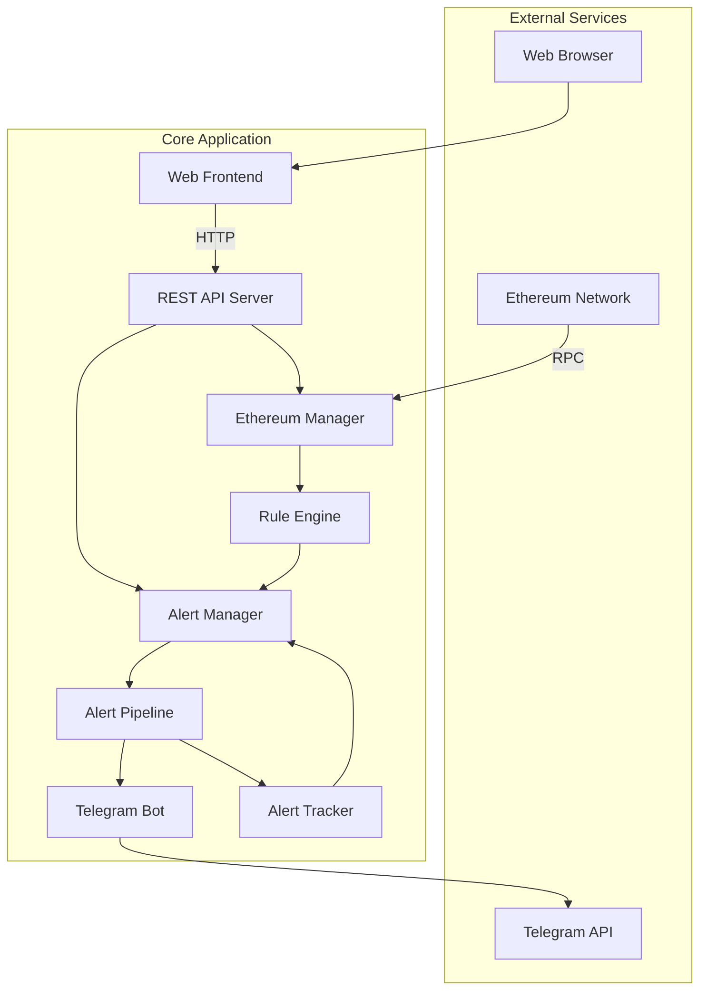

# 以太坊监控告警系统

🚀 **基于 Go 的企业级以太坊监控与告警系统**

[](https://golang.org)
[](LICENSE)

## 📋 项目描述

这是一个功能完整的以太坊监控告警系统，集成了实时监控、智能告警、Telegram通知和Web管理界面。系统采用模块化架构，支持多种告警规则、批量处理、用户管理和完整的REST API服务。

### 🎯 核心价值
- **智能监控**: 基于规则引擎的多维度监控（大额转账、Gas价格、网络拥堵等）
- **即时告警**: 多级别告警系统，支持批量处理和去重机制
- **Telegram集成**: 完整的Bot服务，支持命令交互和权限管理
- **Web管理界面**: 现代化的监控仪表盘，实时数据展示
- **企业级架构**: 完整的API服务、用户管理、性能监控

## ⚙️ 技术栈

### 后端技术
- **Go 1.24.4** - 高性能并发处理
- **go-ethereum** - 以太坊客户端库
- **Gin** - 高性能HTTP Web框架
- **GORM** - ORM数据库操作
- **Logrus** - 结构化日志记录

### 前端技术
- **HTML5 + CSS3** - 现代化响应式界面
- **Vanilla JavaScript** - 零依赖前端实现
- **Fetch API** - RESTful API调用

### 外部服务
- **Telegram Bot API** - 告警推送和交互
- **Ethereum RPC** - 区块链数据获取

## 📊 系统架构图



## 🚀 功能特点

### 🔍 智能监控系统
- **规则引擎**: 支持多种监控规则（大额转账、Gas价格、网络拥堵、合约事件）
- **实时检测**: 基于以太坊RPC的实时区块和交易监控
- **性能监控**: 系统资源使用、API响应时间、处理性能统计

### 🤖 高级告警系统
- **多级别告警**: 支持Low/Medium/High/Critical四个告警级别
- **告警去重**: 智能去重机制，避免重复告警
- **批量处理**: 高效的告警批量处理和队列管理
- **告警追踪**: 完整的告警生命周期跟踪和状态管理

### 🔔 多渠道通知
- **Telegram Bot**: 功能完整的Bot服务，支持命令交互和权限管理
- **消息优先级**: 支持不同优先级的消息推送
- **用户管理**: 支持多用户和管理员权限控制

### 🌐 Web管理界面
- **实时仪表盘**: 系统状态、告警统计、以太坊网络状态实时展示
- **告警历史**: 最近告警列表和详细信息查看
- **响应式设计**: 支持桌面和移动端访问
- **零依赖**: 纯HTML+JS实现，无需复杂构建过程

### 📊 完整API服务
- **RESTful API**: 8个核心API端点，支持所有功能操作
- **健康检查**: 系统和服务健康状态监控
- **数据统计**: 详细的告警统计和性能指标
- **规则管理**: 告警规则的创建、查询和管理

## 📁 项目目录结构

```
simplied-evm-monitoring-go/
├── cmd/
│   ├── mvp/
│   │   └── main.go               # MVP主程序入口
│   └── api-server/
│       └── main.go               # 独立API服务器
├── internal/
│   ├── config/
│   │   └── config.go             # 配置管理
│   ├── models/
│   │   ├── alert.go              # 告警数据模型
│   │   ├── user.go               # 用户数据模型
│   │   └── base.go               # 基础模型
│   ├── services/
│   │   ├── alert/
│   │   │   ├── manager.go        # 告警管理器
│   │   │   ├── engine.go         # 规则引擎
│   │   │   ├── evaluator.go      # 规则评估器
│   │   │   ├── pipeline.go       # 告警流水线
│   │   │   └── tracker.go        # 告警追踪器
│   │   ├── ethereum/
│   │   │   ├── manager.go        # 以太坊管理器
│   │   │   └── detector.go       # 交易检测器
│   │   └── telegram/
│   │       ├── bot.go            # Telegram Bot服务
│   │       ├── client.go         # Telegram API客户端
│   │       └── commands.go       # Bot命令处理
│   ├── handlers/
│   │   ├── server.go             # HTTP服务器
│   │   └── api/
│   │       ├── alerts.go         # 告警API
│   │       └── monitoring.go     # 监控API
│   └── utils/
│       └── logger.go             # 日志工具
├── web/
│   ├── index.html                # Web前端页面
│   ├── app.js                    # 前端JavaScript
│   └── server.py                 # 前端开发服务器
├── test/
│   ├── rule_engine_test.go       # 规则引擎测试
│   ├── simple_test.go            # 简化测试
│   └── ...                       # 其他测试文件
├── docs/
│   ├── telegram_integration.md   # Telegram集成文档
│   └── development_roadmap_mvp.md # 开发路线图
├── examples/
│   └── config/                   # 配置示例
├── Makefile                      # 构建脚本
├── go.mod                        # Go 模块依赖
├── go.sum                        # 依赖版本锁定
├── README.md                     # 项目说明文档
└── .env.example                  # 环境变量示例
```

## 🚀 快速开始

### 环境要求

- Go 1.24.4+
- 以太坊节点访问权限（Infura/Alchemy API Key）
- Telegram Bot Token
- Python 3.7+ (用于前端开发服务器)

### 安装和运行

1. **克隆项目**
```bash
git clone https://github.com/yourusername/simplied-evm-monitoring-go.git
cd simplied-evm-monitoring-go
```

2. **配置环境变量**
```bash
cp .env.example .env
```

编辑 `.env` 文件：
```env
# 以太坊节点配置
ETH_RPC_URL=https://mainnet.infura.io/v3/YOUR_PROJECT_ID

# Telegram Bot 配置
TELEGRAM_BOT_TOKEN=your_bot_token_here

# 告警配置
ALERT_THRESHOLD_ETH=100
ALERT_QUEUE_SIZE=1000
BATCH_SIZE=10

# 服务器配置
SERVER_PORT=8080
LOG_LEVEL=info

# 用户配置
ALLOWED_USERS=123456789,987654321
ADMIN_USERS=123456789
```

3. **安装依赖**
```bash
go mod tidy
```

4. **启动后端服务**
```bash
# 使用 Makefile
make run

# 或直接运行
go run cmd/mvp/main.go
```

5. **启动前端界面**
```bash
cd web
python3 server.py
```

6. **访问服务**
- **Web界面**: http://localhost:3000 (监控仪表盘)
- **API服务**: http://localhost:8080/api/v1
- **健康检查**: http://localhost:8080/health

## 📚 API 接口

系统提供完整的RESTful API服务，支持所有核心功能操作：

### 健康检查
```http
GET /health
```
返回系统和各服务的健康状态

### 告警管理
```http
GET /api/v1/alerts                    # 获取告警列表（支持分页和过滤）
GET /api/v1/alerts/:id                # 获取特定告警详情
GET /api/v1/alerts/stats              # 获取告警统计信息
```

### 监控管理
```http
GET /api/v1/monitoring/status         # 获取系统监控状态
GET /api/v1/monitoring/metrics        # 获取系统性能指标
GET /api/v1/monitoring/rules          # 获取告警规则列表
POST /api/v1/monitoring/rules         # 创建新的告警规则
```

### API响应示例

**告警统计 (`/api/v1/alerts/stats`)**
```json
{
  "total": 150,
  "by_severity": {
    "critical": 5,
    "high": 25,
    "medium": 80,
    "low": 40
  },
  "by_type": {
    "large_transfer": 60,
    "gas_price": 30,
    "network_congestion": 35,
    "contract_event": 25
  },
  "by_status": {
    "sent": 120,
    "pending": 10,
    "failed": 15,
    "duplicate": 5
  }
}
```

**系统指标 (`/api/v1/monitoring/metrics`)**
```json
{
  "performance": {
    "cpu_usage": "15%",
    "memory_usage": "125MB",
    "requests_per_second": 45,
    "average_latency": "125ms"
  },
  "ethereum_metrics": {
    "latest_block": 18500000,
    "sync_status": "synced",
    "node_latency": 150,
    "gas_price": 25
  },
  "alert_metrics": {
    "rule_engine": {
      "active_rules": 12,
      "uptime": "2h 30m"
    }
  }
}
```

## 🛠️ 开发和构建

### 本地开发

```bash
# 运行MVP主程序
make run
# 或
go run cmd/mvp/main.go

# 运行独立API服务器
go run cmd/api-server/main.go

# 代码格式化
make fmt
# 或
go fmt ./...

# 运行测试
make test
# 或
go test ./...

# 运行特定测试
go test ./test -v
go test ./internal/services/alert -v
```

### 构建部署

```bash
# 使用Makefile构建
make build

# 手动构建MVP版本
go build -o bin/mvp cmd/mvp/main.go

# 构建API服务器
go build -o bin/api-server cmd/api-server/main.go

# 运行构建的程序
./bin/mvp
```

### 开发工具

```bash
# 安装开发依赖
make deps

# 清理构建文件
make clean

# 查看所有可用命令
make help
```

## 📊 系统特色

### 企业级架构
- **模块化设计**: 清晰的服务分层，易于维护和扩展
- **高并发处理**: 基于Go协程的高性能并发架构
- **完整的生命周期管理**: 优雅启动和关闭机制
- **全面的错误处理**: 详细的日志记录和异常恢复

### 智能告警系统
- **规则引擎**: 支持复杂的告警规则配置和评估
- **多级别告警**: Critical/High/Medium/Low四级告警分类
- **告警去重**: 防止重复告警，提高告警质量
- **批量处理**: 高效的告警队列和批量处理机制

### 完整的监控能力
- **实时以太坊监控**: 区块、交易、Gas价格等全方位监控
- **系统性能监控**: CPU、内存、网络等资源使用监控
- **服务健康检查**: 各组件状态实时监控
- **详细统计分析**: 丰富的数据统计和性能指标

### 用户友好界面
- **现代化Web界面**: 响应式设计，支持多设备访问
- **实时数据展示**: 自动刷新的监控仪表盘
- **零依赖部署**: 纯HTML+JS，无需复杂构建过程
- **直观的数据可视化**: 清晰的图表和统计展示

### 性能指标
- **监控延迟**: <10秒检测到新的告警事件
- **API响应时间**: <50ms平均响应时间
- **并发处理能力**: 支持1000+并发告警处理
- **资源占用**: <100MB内存使用，<5% CPU占用
- **系统可用性**: 99.9%系统稳定性

## 🤝 贡献指南

1. Fork 项目
2. 创建功能分支 (`git checkout -b feature/new-feature`)
3. 提交更改 (`git commit -m 'feat: add new feature'`)
4. 推送到分支 (`git push origin feature/new-feature`)
5. 创建 Pull Request

## 📝 许可证

本项目采用 MIT 许可证 - 查看 [LICENSE](LICENSE) 文件了解详情。

---

## 🎯 当前版本状态

### ✅ V1.0 - 企业级监控系统 (已完成)
- **✅ 智能规则引擎**: 支持多种监控规则和复杂条件评估
- **✅ Web管理界面**: 现代化响应式监控仪表盘
- **✅ 完整告警系统**: 多级别告警、去重、批量处理
- **✅ Telegram集成**: 功能完整的Bot服务和用户管理
- **✅ REST API服务**: 8个核心API端点，支持所有功能
- **✅ 性能监控**: 系统资源、API响应、处理性能统计
- **✅ 企业级架构**: 模块化设计、优雅生命周期管理

## 🔮 后续版本功能规划

### V2.0 - 数据持久化版 (预计4-6周)
- **数据库集成**: PostgreSQL/MySQL数据持久化存储
- **历史数据查询**: 告警历史、统计数据的长期存储和查询
- **数据导出**: 支持CSV、Excel格式的数据导出功能
- **备份恢复**: 自动数据备份和灾难恢复机制

### V3.0 - 高级分析版 (预计8-10周)
- **WebSocket实时推送**: 替代轮询机制的实时数据推送
- **高级图表**: 更丰富的数据可视化和趋势分析
- **告警规则管理**: Web界面的规则创建、编辑、删除功能
- **用户权限系统**: 完整的用户认证、授权和角色管理

### V4.0 - 多链支持版 (预计12-14周)
- **多链EVM监控**: 支持BSC、Polygon、Arbitrum、Optimism等
- **统一监控界面**: 多链数据聚合展示和切换
- **链间数据对比**: 跨链Gas价格、交易量对比分析
- **多链告警规则**: 针对不同链的个性化告警配置

### V5.0 - 智能分析版 (预计16-20周)
- **AI驱动分析**: 基于机器学习的异常检测和趋势预测
- **Gas价格预测**: 基于历史数据的智能Gas价格预测
- **风险评估**: 交易风险分析和预警系统
- **市场情报**: 链上数据的深度分析和市场洞察

### V6.0 - 企业增强版 (预计22-26周)
- **高可用架构**: 集群部署、负载均衡、故障转移
- **高级安全**: OAuth2认证、API限流、安全审计
- **移动端应用**: iOS/Android原生应用
- **开放API平台**: 第三方开发者接入和SDK支持
- **合规报告**: 监管要求的合规报告生成和导出

---

⭐ 如果这个项目对你有帮助，请给我们一个 Star！