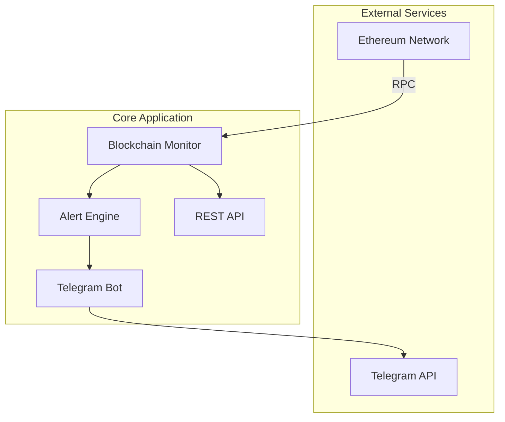

# 区块链监控告警系统 MVP

🚀 **基于 Go 的轻量级以太坊交易监控与告警系统**

[](https://golang.org)
[](LICENSE)

## 📋 项目描述

这是一个轻量级的区块链监控系统MVP版本，专门监控以太坊网络上的大额交易。系统实时连接以太坊节点，监控超过100 ETH的大额转账，并通过Telegram Bot即时推送告警信息。

### 🎯 核心价值
- **实时监控**: 7x24小时监控以太坊主网大额交易
- **即时告警**: 自动检测并推送大额转账信息（>100 ETH）
- **简单易用**: 通过Telegram Bot提供即时告警服务
- **轻量级**: 最小化系统资源占用

## ⚙️ 技术栈

### 后端技术
- **Go 1.24.4** - 高性能并发处理
- **go-ethereum** - 以太坊客户端库
- **Gorilla Mux** - HTTP 路由

### 外部服务
- **Telegram Bot API** - 告警推送

## 📊 系统架构图



## 🚀 功能特点

### 🔍 实时数据监控
- **区块数据追踪**: 实时获取最新区块信息
- **交易监控**: 监控网络交易状态

### 🤖 告警系统
- **大额交易告警**: 自动检测超过 100 ETH 的大额转账
- **交易详情**: 提供发送方、接收方、金额等详细信息

### 🔔 通知渠道
- **Telegram Bot**: 即时推送大额交易告警信息
- **API 接口**: 获取监控数据和历史告警记录

## 📁 项目目录结构

```
blockchain-monitor-mvp/
├── cmd/mvp
│   └── main.go                    # 应用程序入口
├── internal/
│   ├── config/
│   │   └── config.go             # 配置管理
│   ├── models/
│   │   ├── block.go              # 区块数据模型
│   │   ├── transaction.go        # 交易数据模型
│   │   └── alert.go              # 告警数据模型
│   ├── services/
│   │   ├── ethereum/
│   │   │   └── monitor.go        # 以太坊监控服务
│   │   ├── alert/
│   │   │   └── engine.go         # 告警引擎
│   │   └── telegram/
│   │       └── bot.go            # Telegram Bot服务
│   ├── handlers/
│   │   └── api.go                # API处理器
│   └── utils/
│       └── logger.go             # 日志工具
├── go.mod                        # Go 模块依赖
├── go.sum                        # 依赖版本锁定
├── README.md                     # 项目说明文档
└── .env.example                  # 环境变量示例
```

## 🚀 快速开始

### 环境要求
- Go 1.24.4
- 以太坊节点访问权限（Infura/Alchemy API Key）
- Telegram Bot Token

### 安装和运行

1. **克隆项目**
```bash
git clone https://github.com/yourusername/blockchain-monitor-mvp.git
cd blockchain-monitor-mvp
```

2. **配置环境变量**
```bash
cp .env.example .env
```

编辑 `.env` 文件：
```env
# 以太坊节点配置
ETH_RPC_URL=https://mainnet.infura.io/v3/YOUR_PROJECT_ID

# Telegram Bot 配置
TELEGRAM_BOT_TOKEN=your_bot_token_here
TELEGRAM_CHAT_ID=your_chat_id_here

# 告警配置
ALERT_THRESHOLD_ETH=100

# 服务器配置
SERVER_PORT=8080
```

3. **安装依赖**
```bash
go mod tidy
```

4. **运行应用**
```bash
go run cmd/main.go
```

5. **访问服务**
- API 端点: http://localhost:8080/api
- 健康检查: http://localhost:8080/health

## 📚 API 接口

### 获取最新区块信息
```http
GET /api/blocks/latest
```

### 获取告警历史
```http
GET /api/alerts
```

### 获取系统统计
```http
GET /api/stats
```

## 🛠️ 开发和构建

### 本地开发
```bash
# 运行应用
go run cmd/main.go

# 代码格式化
go fmt ./...

# 运行测试
go test ./...
```

### 构建部署
```bash
# 构建可执行文件
go build -o blockchain-monitor cmd/main.go

# 运行
./blockchain-monitor
```

## 📊 MVP特色

### 核心功能
- **专注大额交易**: 专门监控高价值交易，减少噪音
- **即时通知**: 发现大额交易后立即通过Telegram推送
- **简单部署**: 单一可执行文件，最小化依赖
- **轻量级**: 内存占用小，CPU使用率低

### 性能指标
- **监控延迟**: <30秒检测到新的大额交易
- **API响应**: <100ms
- **资源占用**: <50MB内存使用

## 🤝 贡献指南

1. Fork 项目
2. 创建功能分支 (`git checkout -b feature/new-feature`)
3. 提交更改 (`git commit -m 'feat: add new feature'`)
4. 推送到分支 (`git push origin feature/new-feature`)
5. 创建 Pull Request

## 📝 许可证

本项目采用 MIT 许可证 - 查看 [LICENSE](LICENSE) 文件了解详情。

---

## 🔮 后续版本功能规划

### V2.0 - 智能分析版 (预计4-6周)
- **Gas价格预测**: 基于历史数据的Gas价格预测算法
- **Web仪表板**: 数据可视化界面
- **多种告警规则**: 异常合约调用、Gas价格阈值等
- **WebSocket实时推送**: 替代轮询机制提高实时性

### V3.0 - 多链支持版 (预计8-10周)
- **多链EVM监控**: 支持BSC、Polygon、Arbitrum、Optimism等EVM兼容链
- **统一监控界面**: 多链数据聚合展示
- **链间数据对比**: 跨链Gas价格、交易量对比分析
- **多链告警规则**: 针对不同链的个性化告警配置

### V4.0 - 高级分析版 (预计12-14周)
- **趋势分析**: 历史数据分析和市场趋势识别
- **网络健康度评估**: 综合网络状态指标
- **用户管理系统**: 多用户支持和个性化设置
- **更多通知渠道**: 邮件、微信等多种推送方式
- **高级数据分析**: 链上资金流向分析、鲸鱼地址追踪

### V5.0 - 跨链套利版 (预计16-20周)
- **跨链价格监控**: 实时监控多链间代币价格差异
- **套利机会识别**: 智能识别跨链套利机会
- **收益率计算**: 考虑Gas费用、滑点的精确收益计算
- **风险评估**: 套利风险分析和预警
- **模拟交易**: 套利策略回测和模拟执行
- **自动化提醒**: 高收益套利机会实时推送

### V6.0 - 企业级版 (预计22-26周)
- **高可用架构**: 集群部署和负载均衡
- **数据持久化**: 数据库存储和历史数据查询
- **高级安全**: 用户认证、API限流等
- **移动端支持**: iOS/Android应用
- **API开放平台**: 第三方开发者接入支持
- **机构级功能**: 大资金量监控、合规报告生成

---

⭐ 如果这个项目对你有帮助，请给我们一个 Star！