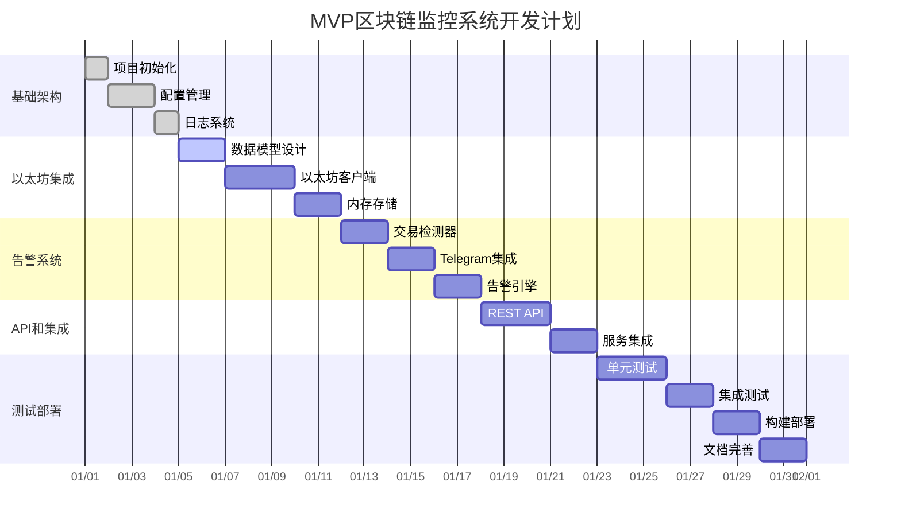

# 📈 MVP版区块链监控系统 - 最佳编程实践开发路线图

> **重要说明**: 每个 Step 都包含详细的实现指导、代码示例和验证步骤，确保 AI 之间可以无缝交接继续开发。每个阶段完成后必须创建对应的 `docs/{step}.md` 文档。

## 🎯 MVP核心功能范围

**必须实现的核心功能：**
1. **基础区块链监控** - 连接以太坊节点，获取基本区块数据
2. **简单告警机制** - 大额交易告警（>100 ETH）
3. **Telegram Bot** - 基础消息推送
4. **基本API接口** - 获取监控数据的REST API

## 🚀 第一阶段：项目基础搭建

### Step 1.1: 项目初始化和基础架构
**功能**: 创建MVP项目结构，配置开发环境
**前置条件**: 无
**输入依赖**: Go 1.24.4, Git
**实现内容**:
- 初始化 Go 模块和依赖管理 (`go mod init blockchain-monitor-mvp`)
- 创建MVP项目目录结构 (简化版 cmd/, internal/, pkg/)
- 配置 Git 仓库和 .gitignore (Go 特定忽略规则)
- 创建基础的 Makefile (build, test, clean, run 命令)
- 创建 README.md MVP版本结构
**输出交付**:
```
blockchain-monitor-mvp/
├── cmd/mvp
│   └── main.go                    # 应用程序入口
├── internal/
│   ├── config/
│   ├── models/
│   ├── services/
│   └── handlers/
├── pkg/
│   └── logger/
├── go.mod
├── go.sum
├── Makefile
└── README.md
```
**验证步骤**:
- `go mod tidy` 执行成功
- `make help` 显示可用命令
- Git 仓库初始化成功
**文档要求**: 创建 `docs/1.1.md` 包含MVP项目结构说明和开发环境配置指南
**Git Commit**: `feat: initialize mvp project structure and development environment`

### Step 1.2: 简化配置管理系统
**功能**: 实现MVP必需的配置管理
**前置条件**: Step 1.1 完成
**输入依赖**: github.com/joho/godotenv
**实现内容**:
- 设计MVP配置结构体 (internal/config/config.go) - 仅包含以太坊节点、Telegram Bot、服务器配置
- 实现环境变量加载 (internal/config/env.go) - 支持 .env 文件
- 创建配置文件模板 (.env.example) - MVP必要参数
- 基础配置验证机制
**输出交付**:
- internal/config/config.go (MVP配置结构体)
- internal/config/env.go (配置加载器)
- .env.example (MVP配置模板)
**验证步骤**:
- 配置加载测试通过
- .env.example 中所有MVP参数都有说明
**文档要求**: 创建 `docs/1.2.md` 包含MVP配置系统使用指南
**Git Commit**: `feat: implement mvp configuration management system`

### Step 1.3: 基础日志系统
**功能**: 建立简单的日志记录
**前置条件**: Step 1.2 完成
**输入依赖**: github.com/sirupsen/logrus
**实现内容**:
- 实现简单日志记录器 (pkg/logger/logger.go) - 基础多级别日志
- 基础错误处理机制
- 日志格式化和输出配置
**输出交付**:
- pkg/logger/logger.go (日志系统)
- internal/utils/errors.go (错误处理)
**验证步骤**:
- 日志输出正常，格式正确
- 错误处理机制测试通过
**文档要求**: 创建 `docs/1.3.md` 包含MVP日志系统使用指南
**Git Commit**: `feat: add basic logging system for mvp`

## 🔗 第二阶段：以太坊集成和数据模型

### Step 2.1: MVP数据模型设计
**功能**: 设计MVP必需的数据结构
**前置条件**: Step 1.3 完成
**输入依赖**: 无新依赖
**实现内容**:
- 设计简化区块数据结构 (internal/models/block.go) - 仅包含基本区块信息
- 设计简化交易数据结构 (internal/models/transaction.go) - 重点关注金额和地址
- 设计基础告警数据结构 (internal/models/alert.go) - 简单告警记录
- 内存存储数据结构 (无需数据库)
**输出交付**:
- internal/models/block.go (区块模型)
- internal/models/transaction.go (交易模型)  
- internal/models/alert.go (告警模型)
- internal/models/common.go (通用方法)
**验证步骤**:
- 数据模型单元测试通过
- 序列化/反序列化测试通过
**文档要求**: 创建 `docs/2.1.md` 包含MVP数据模型设计文档
**Git Commit**: `feat: design mvp blockchain data models`

### Step 2.2: 以太坊客户端集成
**功能**: 建立基础以太坊节点连接
**前置条件**: Step 2.1 完成
**输入依赖**: github.com/ethereum/go-ethereum
**实现内容**:
- 实现基础以太坊 RPC 客户端 (internal/services/ethereum/client.go) - HTTP 连接
- 实现区块数据获取接口 (internal/services/ethereum/monitor.go) - 轮询方式获取最新区块
- 实现交易数据解析 (internal/services/ethereum/parser.go) - 提取交易金额和地址
- 基础连接健康检查
**输出交付**:
- internal/services/ethereum/client.go (以太坊客户端)
- internal/services/ethereum/monitor.go (监控服务)
- internal/services/ethereum/parser.go (数据解析器)
**验证步骤**:
- 以太坊节点连接测试通过
- 区块和交易数据获取测试通过
**文档要求**: 创建 `docs/2.2.md` 包含以太坊客户端集成指南
**Git Commit**: `feat: integrate ethereum client for mvp monitoring`

### Step 2.3: 内存数据存储
**功能**: 实现MVP内存数据管理
**前置条件**: Step 2.2 完成
**输入依赖**: 无新依赖
**实现内容**:
- 实现内存数据存储管理器 (internal/storage/memory.go) - 线程安全的内存存储
- 实现数据缓存和限制机制 (避免内存溢出)
- 基础数据查询接口
- 数据持久化到文件 (可选，用于重启恢复)
**输出交付**:
- internal/storage/memory.go (内存存储管理器)
- internal/storage/interface.go (存储接口定义)
**验证步骤**:
- 内存存储功能测试通过
- 并发安全测试通过
- 数据查询接口测试通过
**文档要求**: 创建 `docs/2.3.md` 包含内存存储系统使用指南
**Git Commit**: `feat: implement in-memory data storage for mvp`

## 🚨 第三阶段：核心告警功能

### Step 3.1: 大额交易检测器
**功能**: 实现大额交易监控逻辑
**前置条件**: Step 2.3 完成
**输入依赖**: 无新依赖
**实现内容**:
- 实现交易金额检测器 (internal/services/alert/detector.go) - 检测>100 ETH交易
- 实现告警条件判断逻辑 (internal/services/alert/rules.go) - 简单规则引擎
- 实现告警事件生成器 (internal/services/alert/generator.go) - 生成告警记录
- 基础告警去重机制 (避免重复告警)
**输出交付**:
- internal/services/alert/detector.go (检测器)
- internal/services/alert/rules.go (规则引擎)
- internal/services/alert/generator.go (事件生成器)
**验证步骤**:
- 大额交易检测功能测试通过
- 告警生成逻辑测试通过
- 去重机制测试通过
**文档要求**: 创建 `docs/3.1.md` 包含大额交易检测算法说明
**Git Commit**: `feat: implement large transaction detection for mvp`

### Step 3.2: Telegram Bot 集成
**功能**: 实现基础Telegram告警推送
**前置条件**: Step 3.1 完成
**输入依赖**: github.com/go-telegram-bot-api/telegram-bot-api/v5
**实现内容**:
- 实现Telegram Bot基础功能 (internal/services/telegram/bot.go) - 消息发送
- 实现告警消息格式化 (internal/services/telegram/formatter.go) - 美化告警消息
- 实现基础命令处理 (internal/services/telegram/handlers.go) - /start, /help, /status命令
- 实现消息发送重试机制
**输出交付**:
- internal/services/telegram/bot.go (Telegram Bot)
- internal/services/telegram/formatter.go (消息格式化器)
- internal/services/telegram/handlers.go (命令处理器)
**验证步骤**:
- Telegram Bot消息发送测试通过
- 命令处理功能测试通过
- 重试机制测试通过
**文档要求**: 创建 `docs/3.2.md` 包含Telegram Bot集成和使用指南
**Git Commit**: `feat: integrate telegram bot for mvp alert notifications`

### Step 3.3: 告警引擎集成
**功能**: 连接监控和告警系统
**前置条件**: Step 3.2 完成
**输入依赖**: 无新依赖
**实现内容**:
- 实现告警引擎协调器 (internal/services/alert/engine.go) - 连接监控和通知
- 实现监控数据到告警的数据流 (internal/services/alert/pipeline.go)
- 实现告警状态管理 (internal/services/alert/state.go) - 简单状态跟踪
- 错误处理和故障恢复机制
**输出交付**:
- internal/services/alert/engine.go (告警引擎)
- internal/services/alert/pipeline.go (数据流水线)
- internal/services/alert/state.go (状态管理)
**验证步骤**:
- 端到端告警流程测试通过
- 错误处理机制测试通过
- 告警状态管理测试通过
**文档要求**: 创建 `docs/3.3.md` 包含告警引擎设计和工作流程
**Git Commit**: `feat: implement alert engine integration for mvp`

## 🌐 第四阶段：API接口和用户界面

### Step 4.1: 基础REST API
**功能**: 实现MVP必需的API接口
**前置条件**: Step 3.3 完成
**输入依赖**: github.com/gin-gonic/gin
**实现内容**:
- 实现基础HTTP服务器 (internal/handlers/server.go) - Gin框架集成
- 实现区块数据API (internal/handlers/api/blocks.go) - 获取最新区块信息
- 实现告警历史API (internal/handlers/api/alerts.go) - 获取告警记录
- 实现系统状态API (internal/handlers/api/health.go) - 健康检查和统计
- 基础CORS和错误处理中间件
**输出交付**:
- internal/handlers/server.go (HTTP服务器)
- internal/handlers/api/blocks.go (区块API)
- internal/handlers/api/alerts.go (告警API)
- internal/handlers/api/health.go (健康检查API)
**验证步骤**:
- 所有API接口测试通过
- HTTP服务器启动和关闭测试通过
- 中间件功能测试通过
**文档要求**: 创建 `docs/4.1.md` 包含API设计文档和使用指南
**Git Commit**: `feat: implement basic rest api endpoints for mvp`

### Step 4.2: 主程序入口和服务集成
**功能**: 实现应用程序主入口
**前置条件**: Step 4.1 完成
**输入依赖**: 无新依赖
**实现内容**:
- 实现主程序入口 (cmd/main.go) - 服务启动和协调
- 实现服务生命周期管理 (internal/app/app.go) - 优雅启动和关闭
- 实现并发服务管理 - 监控服务和API服务并行运行
- 实现信号处理和优雅关闭
- 基础性能监控和资源管理
**输出交付**:
- cmd/main.go (主程序入口)
- internal/app/app.go (应用程序管理器)
- internal/app/lifecycle.go (生命周期管理)
**验证步骤**:
- 应用程序启动和关闭测试通过
- 并发服务管理测试通过
- 信号处理和优雅关闭测试通过
**文档要求**: 创建 `docs/4.2.md` 包含应用程序架构和启动流程
**Git Commit**: `feat: implement main application entry and service integration`

## 🔧 第五阶段：测试和部署

### Step 5.1: 单元测试实现
**功能**: 实现核心功能单元测试
**前置条件**: Step 4.2 完成
**输入依赖**: github.com/stretchr/testify
**实现内容**:
- 编写核心服务单元测试 (tests/unit/) - 覆盖所有核心功能
- 实现测试辅助工具 (tests/testutil/) - Mock和测试数据生成
- 编写配置和工具函数测试
- 实现测试覆盖率报告 - 目标覆盖率>70%
**输出交付**:
- tests/unit/ (单元测试套件)
- tests/testutil/ (测试工具)
- Makefile 更新 (test命令)
**验证步骤**:
- 所有单元测试通过
- 测试覆盖率达到目标
- CI集成测试通过
**文档要求**: 创建 `docs/5.1.md` 包含测试策略和实践指南
**Git Commit**: `test: implement unit tests for mvp core functionality`

### Step 5.2: 集成测试和端到端测试
**功能**: 实现系统集成测试
**前置条件**: Step 5.1 完成
**输入依赖**: 无新依赖
**实现内容**:
- 编写API集成测试 (tests/integration/) - 完整API流程测试
- 实现端到端测试场景 (tests/e2e/) - 监控到告警的完整流程
- 实现测试环境管理 - 模拟以太坊数据和Telegram环境
- 添加性能基准测试 - 基础性能指标验证
**输出交付**:
- tests/integration/ (集成测试)
- tests/e2e/ (端到端测试)
- tests/benchmark/ (性能测试)
**验证步骤**:
- 所有集成测试和E2E测试通过
- 性能基准测试达标
- 测试环境自动化管理测试通过
**文档要求**: 创建 `docs/5.2.md` 包含集成测试和性能测试指南
**Git Commit**: `test: implement integration and e2e tests for mvp`

### Step 5.3: 构建和部署脚本
**功能**: 实现自动化构建和部署
**前置条件**: Step 5.2 完成
**输入依赖**: Docker (可选)
**实现内容**:
- 完善Makefile构建脚本 - build, test, clean, install命令
- 创建简单的Docker化支持 (可选) - Dockerfile和docker-compose.yml
- 实现部署脚本 (scripts/deploy.sh) - 简单的服务器部署
- 创建systemd服务文件 (deployments/systemd/) - Linux服务管理
- 添加配置文件验证和环境检查
**输出交付**:
- Makefile (完整构建脚本)
- Dockerfile (可选)
- docker-compose.yml (可选)
- scripts/deploy.sh (部署脚本)
- deployments/systemd/ (服务配置)
**验证步骤**:
- 构建脚本执行成功
- Docker化部署测试通过(如果实现)
- 部署脚本在目标环境测试通过
**文档要求**: 创建 `docs/5.3.md` 包含构建和部署指南
**Git Commit**: `feat: implement build and deployment scripts for mvp`

### Step 5.4: 文档完善和发布准备
**功能**: 完善MVP文档和发布准备
**前置条件**: Step 5.3 完成
**输入依赖**: 无新依赖
**实现内容**:
- 完善README.md - MVP功能说明和快速开始指南
- 创建API文档 (docs/api.md) - 完整的API参考
- 编写部署指南 (docs/deployment.md) - 生产环境部署指南
- 创建故障排查指南 (docs/troubleshooting.md) - 常见问题解决
- 编写版本发布说明 (CHANGELOG.md) - MVP v1.0.0发布说明
- 代码注释完善和代码质量检查
**输出交付**:
- README.md (完善的项目说明)
- docs/api.md (API文档)
- docs/deployment.md (部署指南)
- docs/troubleshooting.md (故障排查)
- CHANGELOG.md (版本说明)
**验证步骤**:
- 所有文档内容完整性验证通过
- 文档链接和格式检查通过
- 代码质量检查通过
**文档要求**: 创建 `docs/5.4.md` 包含文档维护和发布流程
**Git Commit**: `docs: complete mvp documentation and prepare for release`

## 📊 MVP开发时间线



## 🎯 MVP成功标准

### 功能标准
- ✅ 能够连接以太坊主网并获取实时区块数据
- ✅ 能够检测大于100 ETH的交易并生成告警
- ✅ 能够通过Telegram Bot发送告警消息
- ✅ 提供基础的REST API查询接口
- ✅ 系统稳定运行24小时无崩溃

### 性能标准
- ✅ 监控延迟 < 60秒
- ✅ API响应时间 < 500ms
- ✅ 内存使用 < 100MB
- ✅ CPU使用率 < 10% (空闲时)

### 质量标准
- ✅ 单元测试覆盖率 > 70%
- ✅ 所有集成测试通过
- ✅ 代码遵循Go最佳实践
- ✅ 完整的部署文档

## 🔄 从MVP到后续版本的升级路径

### V2.0 升级准备 (在MVP基础上)
- 数据库集成准备 (预留接口)
- WebSocket支持准备
- 配置热重载机制
- 更详细的监控指标

### V3.0 多链支持准备
- 抽象区块链客户端接口
- 统一的数据模型设计
- 可扩展的配置结构

### 关键设计原则
- **接口优先**: 所有核心组件都定义清晰的接口
- **配置驱动**: 通过配置支持不同的运行模式
- **可观测性**: 预留监控和日志接口
- **向后兼容**: API设计考虑后续版本兼容性

---

⭐ 这个开发路线图确保MVP能够快速交付，同时为后续版本奠定坚实基础！